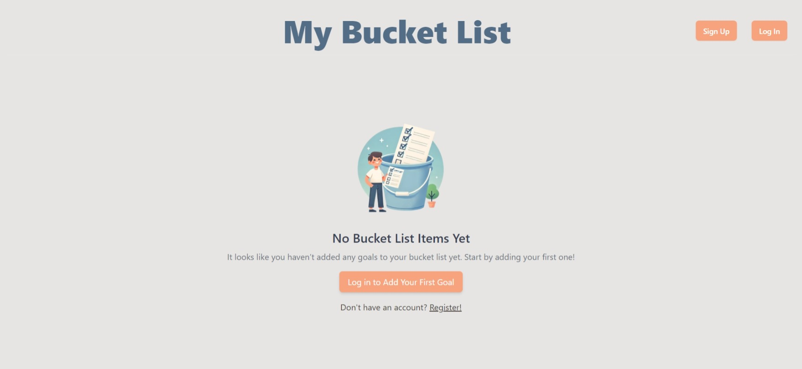
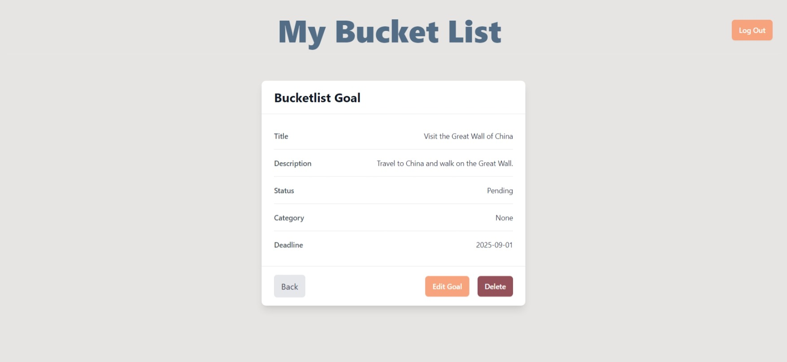

# Bucket List Tracker

A web application built with Laravel that allows users to track, manage, and categorize their personal bucket list goals. The app includes features such as user authentication, CRUD operations for goals, filtering by status and category, and a search function.


## Features

### 1. User Authentication
- **Sign up / Log in**: Users can create accounts and log in to track their own bucket list.
- **Log out**: Securely log out of the application.

### 2. CRUD Operations
- **Add**: Users can add new goals to their bucket list, including a title, description, and an image.
- **Read**: View a list of goals with images and statuses.
- **Update**: Edit existing goals to change their status or details.
- **Delete**: Remove completed or unwanted goals from the list.

### 3. Filter Options
- **By Status**: Users can filter goals by their current status (e.g., Pending, In Progress, Completed).
- **By Category**: Users can categorize their goals (e.g., Travel, Skills & Learning, Fitness & Health).

### 4. Search Functionality
- **Search by Title**: Easily search for goals by entering keywords in the search bar.

## Tech Stack
- **Backend**: Laravel (PHP)
- **Frontend**: Blade templates, HTML, CSS (Tailwind)
- **Database**: MySQL
- **Authentication**: Built-in Laravel authentication
- **Image Storage**: Public image uploads for goal representation

## Screenshots

### Guest Screen 


### Add Goal Form


### View Goal Details


## Installation

1. **Clone the repository**:
    ```bash
    git clone https://github.com/your-username/bucket-list-tracker.git
    ```

2. **Install dependencies**:
    ```bash
    cd bucket-list-tracker
    composer install
    npm install
    npm run dev
    ```

3. **Set up environment file**:
    Copy `.env.example` to `.env` and configure your database settings:
    ```bash
    cp .env.example .env
    ```

4. **Generate the application key**:
    ```bash
    php artisan key:generate
    ```

5. **Run migrations**:
    ```bash
    php artisan migrate
    ```

6. **Run the application**:
    ```bash
    php artisan serve
    ```

## Usage

- Sign up or log in to create a personal bucket list.
- Use the "Add Goal" button to create new goals.
- Filter your goals by status or category.
- Use the search bar to quickly find specific goals.
  
## Future Enhancements

- **Goal Reminders**: Get notifications for upcoming goals or due dates.
- **Sharing**: Share goals or completed tasks with friends.
- **Progress Tracking**: Add a percentage progress tracker for long-term goals.


